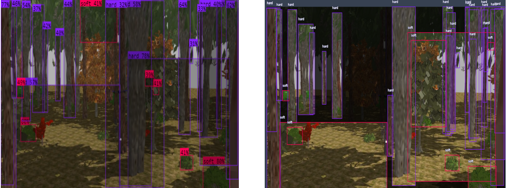
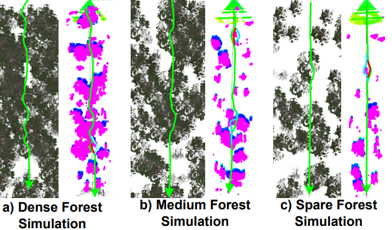
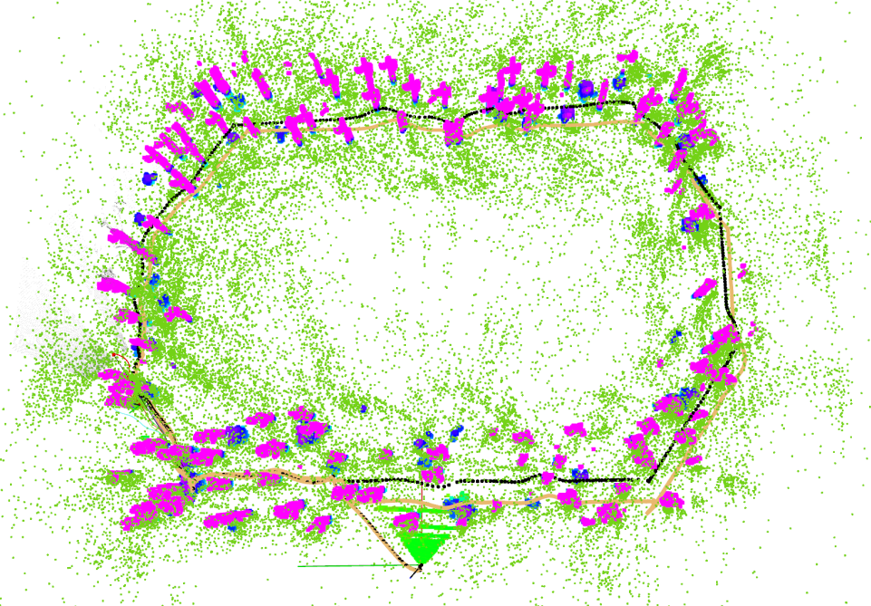
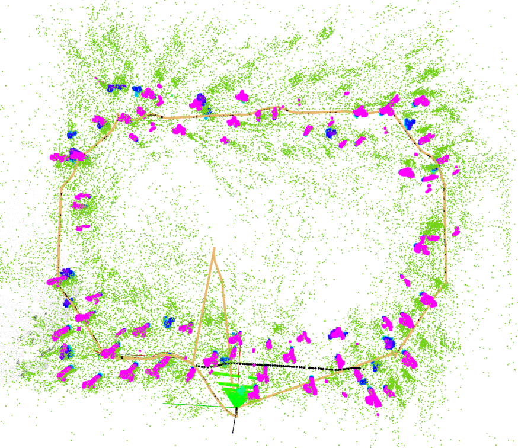

 ## Contributors ✨
- [@hurkansah](https://github.com/hurkansah) 

# Autonomous UAV Navigation in Complex Environments

This project presents a navigation framework for autonomous UAVs operating in cluttered, GPS-denied environments such as forests. The system integrates ORB-SLAM3, a path planner (Fast Planner / RAPTOR), and object detection to ensure safe, real-time trajectory planning.

[](https://www.youtube.com/watch?v=YOUTUBE_VIDEO_ID)

<iframe width="560" height="315" src="https://www.youtube.com/embed/CqKVABOreqM?si=cUzk1w5BuRJynjY9" title="YouTube video player" frameborder="0" allow="accelerometer; autoplay; clipboard-write; encrypted-media; gyroscope; picture-in-picture; web-share" referrerpolicy="strict-origin-when-cross-origin" allowfullscreen></iframe>


# Key Features
Simulation Environment: Gazebo-based forest simulations for testing.
SLAM & Localization: ORB-SLAM3 with stereo vision for accurate obstacle detection.
Path Planning: Fast Planner (RAPTOR) for real-time, collision-free trajectory generation.
Object Detection: YOLOv8-based model distinguishing hard (trees) and soft (bushes) objects.
Geometric Control: Ensures stable and accurate trajectory following.
System Components

# Visual SLAM
[ORB-SLAM3 ROS PACKAGE](https://github.com/thien94/orb_slam3_ros)
A ROS implementation of ORB_SLAM3 by thien94. 

- ORB-SLAM3 (stereo) for real-time mapping and localization.
Integration with Intel RealSense D435 for depth sensing. Correcting axes coordinates. 

# Path Planning
[Fast Planener](https://github.com/HKUST-Aerial-Robotics/Fast-Planner)

HKUST-Aerial-Robotics, A Robust and Efficient Trajectory Planner for Quadrotors

- RAPTOR planner generates optimized paths using ESDF-based trajectory smoothing.
Collision avoidance and dynamic re-planning in real-time.
To connect with controller and flight manager, the code is arranged

# Controller
[Geometric Controller](https://github.com/Jaeyoung-Lim/mavros_controllers)
Jaeyoung-Lim, Aggressive trajectory tracking using mavros for PX4 enabled vehicles.

-Geometric tracking controller for robust flight stability.
PID-based tuning with integral compensation.

# Object Detection
[YoloV3](https://github.com/leggedrobotics/darknet_ros)
leggedrobotics, YOLO ROS: Real-Time Object Detection for ROS.

-Trained YOLOv3 model with 265K+ labeled forest images.
Smart polygon annotations for improved accuracy.

<p align="center">

</p>


# Global Planner (A Manager)

A local planner utilizes goal information to generate safe trajectories for the geometric controller, avoiding collisions with obstacles. This information is managed by a  dedicated system that assigns new goals after each completed trajectory, ensuring continuous operation. If the planner detects obstacles or object detection identifies hard objects, the state manager selects the next goal from its pre-defined list. It’s
important to note that this component is not a robust global planner for environment exploration. 
[State Manager](resources/statemanager.pdf) 

# Integration with PX4, Geometric Controller and Fast Planner 
[PX4 Fast Planner](https://github.com/mzahana/px4_fast_planner)
Mzahana, Integration of Fast-Planner with PX4 autopilot for multi-rotor fast navigation with obstacle avoidance.

This is a really helpful implementation for understanding TF frames needed by fast-planner and integration of the geometric controller. 

# Simulation
- To use the depth camera sensor plugins, [E2ES](https://github.com/HKPolyU-UAV/E2ES), A complete MAV simulation on Gazebo is used.

- [forest generator](https://github.com/hurkansah/forest_gen)
hurkansah, a Random forest generator with using different types of bushes and trees to create test environments for Gazebo

The process of generating the forest generation was modified and adapted to this project, from the forest generation script employed in Oleynikova et al. In their research, Oleynikova et al developed a script for creating randomized forests that are openly accessible for research objectives. This script plays a crucial role in uniformly selecting the position, direction, and density of the trees. Additionally, it generates the world description file.

<p align="center">

</p>


Simulation experiments were conducted using a desktop computer with an Nvidia RTX 3060 graphics card. To achieve better results, Nvidia CUDA and CUDNN plugins were utilized. The experiments were performed on Ubuntu 20.04 LTS and ROS Noetic within PX4’s Software-In-The-Loop (SITL) environment. The Gazebo simulator version 11.0 was used with a simulated Intel RealSense D435 depth camera plugin connected to the Forest Drone shown in Figure. 

-PX4 SITL and Gazebo 11.
Test cases include various forest densities and obstacle layouts.
Performance & Results
Localization Accuracy: Mean error between 0.5 - 0.8 meters.
Trajectory Following: Average deviation ~0.1m.
Object Detection: High precision for hard/soft object classification.
Future Work
Real-world testing with an actual drone platform.
Extended multi-UAV navigation for cooperative exploration.
Integration with reinforcement learning for adaptive flight behavior.

# Simulation Scenarios
To evaluate the fast planner's performance, three scenarios were simulated using a long, 60-meter road. In each scenario, the system was assessed for potential collisions with the air vehicle. As illustrated in Figure, the planned path is depicted by the green lines. The left side of each sub-figure shows a top-down view from the Gazebo model, while the right side displays the corresponding RVIZ visualization of the ESDF map and trajectory.

<p align="center">

</p>

Virtualization of the PointCloud data is only possible in RVIZ because of the data type saved by ORB-SLAM3. This data format, likely a proprietary binary format (".osa"), is difficult to interpret directly. RVIZ acts as a bridge to visualize this data, helping represent potential obstacles and empty paths within the forest environment. As depicted in Figure, in a 50x50 m forest area, the yellow points (point clouds), illustrate the possible places of the trees on the map. Pink and blue shapes are the ESDF map of the trees. Yellow points have more side of view than the yellow one (because ESDF uses depth information and small side view) so we can have more field of view information using ORB-SLAM3. Besides this, the ESDF map has distance information between the quadcopter and the tree. So, it gives really important data to draw the trajectory. In the ESDF map,  the pink color means that it is the most possible point air vehicle can hit, and the blues are the bushes which are the objects that have a low possibility of hitting. In the end, the green color is the ground which shows the takeoff point. 

<p align="center">
  
  
</p>


Furthermore, the Figure also has the position information of the camera and keyframe trajectory. The light orange color indicates the camera trajectory (estimated position) and the black dot line shows the keyframe trajectory. At some part in the camera, the trajectory fails to track which line goes to the initial point or follows a different track. After the SLAM detects a loop, then it merges the map and relocalizes the camera position. At that time, the keyframe trajectory fixes the path and gives the correct trajectory which belongs to the loop. As mentioned before, the most failed track is shown in the aggressive motion, or failing to merge the map can confuse the tracking part. In both scenarios, the right bottom part shows the same behavior. 
 

# Installation Guide: Autonomous UAV Navigation System
This guide provides step-by-step instructions for installing the necessary dependencies, drivers, and software for the project.

## Step 1: Install NVIDIA Drivers
## Step 2: Install CUDA
.
.
.
Please check the other project dependencies and installation paths.

## Step: Run the Simulation

1.) Start the simulation

```
./sim.sh
```

2.) Start the ORB-SLAM3

```
roslaunch orb_slam3_ros euroc_stereo_E2ES.launch
```

3.) Run the Goal sender 

```
rosrun px4_fast_planner GoalSender.py 
```

